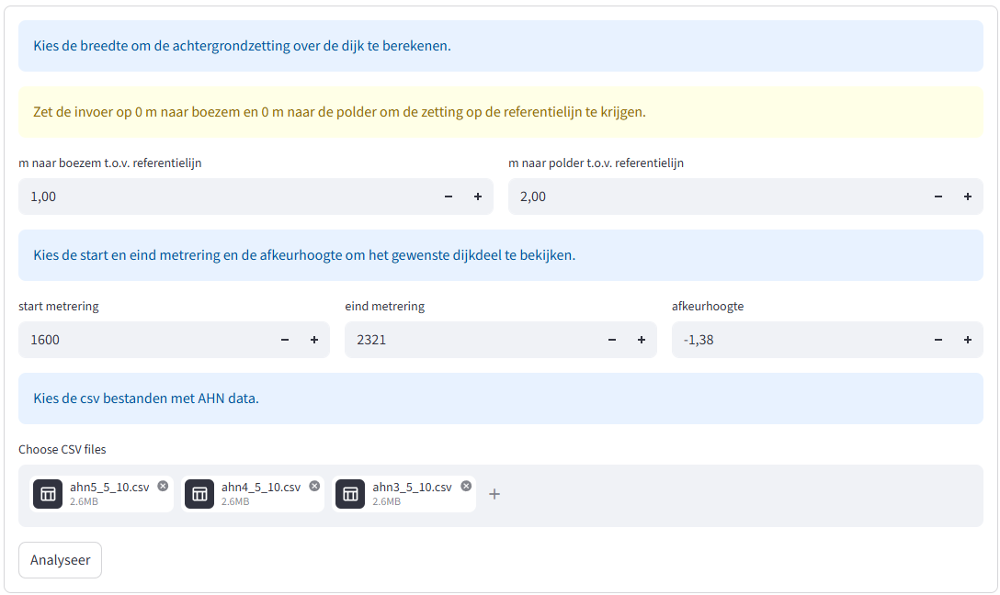
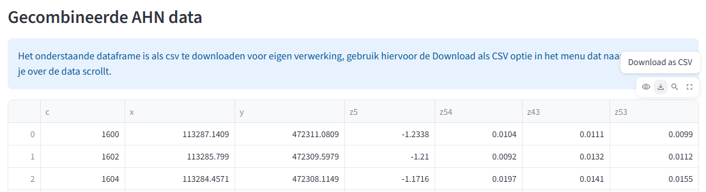
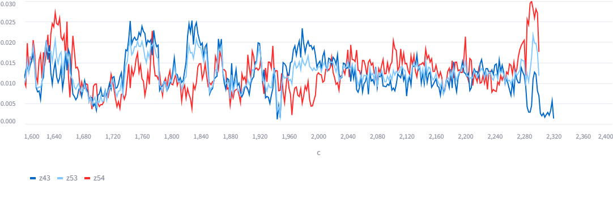
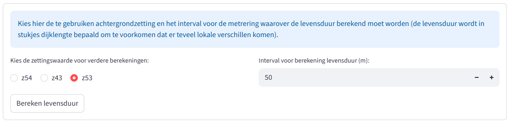
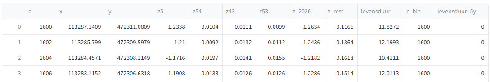
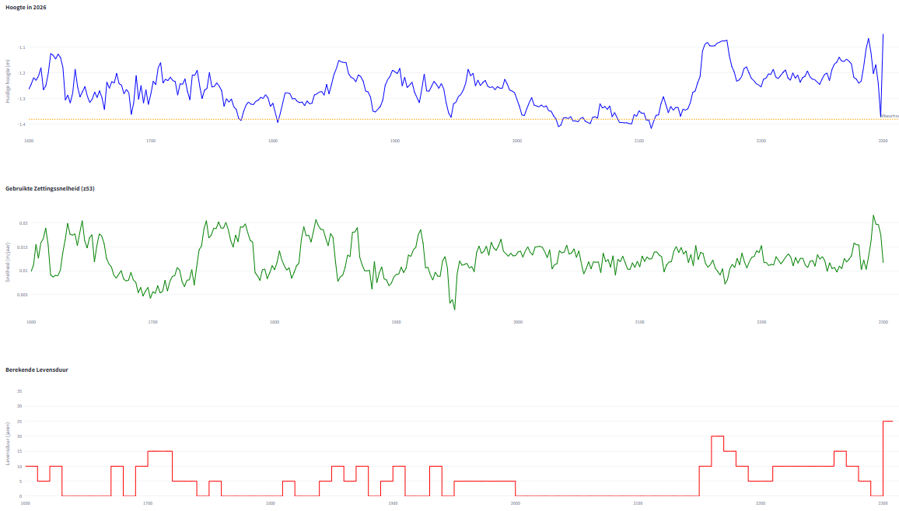

# Levensduur bepaling voor de hoogte van een dijk

Deze app is bedoeld om de levensduur van een dijk te bepalen o.b.v. de minimaal vereiste hoogte, beschikbare AHN gegevens en de daaruit te berekenen achtergrondzetting. De vereiste data wordt gegenereerd vanuit een Breinbaas script die over de lengte en breedte van een dijk hoogtegegevens ophaalt voor AHN3, 4 en 5. 

## Info
* Mei 2026
* Rob van Putten | breinbaas@pm.me | rob.van.putten@agv.nl

## Update 

Bij de nieuwe versie van de app zijn de volgende aanpassingen gedaan;

* het is nu mogelijk om de hoogte van de dijk te bepalen over een opgegeven breedte, hierbij wordt binnen de opgegeven breedte gezocht naar de 4 aaneengesloten hoogste punten waarvan het laagste punt gebruikt wordt als kruinhoogte (in tegenstelling tot het gebruik van enkel 1 punt op de referentielijn)
* download optie verwijderd, makkelijker om individueel te downloaden

## Bekende bugs / restricties
* De download optie voor de grafieken werkt enkel op Chrome browsers

## CSV input format
Het format van de vereiste input is;

```
c,l,x,y,z
900.0,-5.0,113839.86726725167,472394.5549774822, 
900.0,-4.5,113839.9941905266,472395.0385997338,-1.6480000019073486
900.0,-4.0,113840.12111380152,472395.52222198545,-1.656999945640564
...
900.0,0.0,113841.13650000095,472399.39119999856,-1.0850000381469727 
900.0,0.5,113841.26342327589,472399.8748222502,-1.034000039100647
...
900.0,9.5,113843.54804222459,472408.5800227797,-3.072000026702881
900.0,10.0,113843.67496549952,472409.06364503136,-3.1410000324249268 
```

Waarbij:
* c = metrering (m)
* l = afstand vanaf de referentielijn (m), negatief is richting boezem, positief is richting polder
* x = x-coördinaat (RD)
* y = y-coördinaat (RD)
* z = z-waarde (m tov NAP)

De rijen met l=0.0 zijn dus de punten op de refentielijn.

De bestanden moeten ```ahnx_<watdanook>.csv``` heten dus bv ahn3_5_10.csv en ahn4_5_10.csv en ahn5_5_10.csv omdat de versie van de ahn gehaald wordt uit de bestandsnaam.

## Werkwijze applicatie

De applicatie staat op https://levensduur.streamlit.app/ 

De werkwijze en vereiste invoer voor de applicatie is als volgt;

### Achtergrondzetting berekening

#### m naar boezem t.o.v. referentielijn
De afstand richting de boezem t.o.v. referentielijn waarbij de beschikbare AHN punten worden meegenomen (de dichtheid bij AHN3, 4 en 5 is 0.5m). Standaard op 1m.

#### m naar polder t.o.v. referentielijn
De afstand richting de polder t.o.v. referentielijn waarbij de beschikbare AHN punten worden meegenomen (de dichtheid bij AHN3, 4 en 5 is 0.5m). Standaard op 2m.

#### start metrering
De startmetrering van het dijkdeel waarvoor de levensduur berekend moet worden. Zie de csv bestanden voor de min en max. Standaard op 0.

#### eind metrering
De eindmetrering van het dijkdeel waarvoor de levensduur berekend moet worden. Zie de csv bestanden voor de min en max. Standaard op 9999.

#### afkeur hoogte
De afkeur hoogte van het dijkdeel in meters (m tov NAP). **NB** Sommige dijkdelen hebben verschillende afkeur hoogtes en dienen dan individueel beschouwd te worden



De applicatie combineert de opgegeven data en berekent de achtergrondzetting voor de periodes AHN3 - AHN4, AHN4 - AHN5 en AHN3 - AHN5. **Let op** de applicatie is bedoeld voor het beheergebied van AGV en gaat uit van de invlieg jaren van deze locaties van het AHN. Deze jaren staan hieronder vermeld;

* AHN3: 2015
* AHN4: 2020
* AHN5: 2023

De applicatie toont een dataframe dat als csv bestand te downloaden is met de volgende informatie in de kolommen;

* c: metrering (m)
* x: x-coördinaat (RD)
* y: y-coördinaat (RD)
* z5: hoogte ten tijd van AHN5 (m tov NAP)
* z54: achtergrondzetting AHN4 - AHN5 (m/jaar)
* z43: achtergrondzetting AHN3 - AHN4 (m/jaar)
* z53: achtergrondzetting AHN3 - AHN5 (m/jaar)



Onder het dataframe verschijnt een grafiek met daarin de berekende achtergrondzettingen per periode. 



### Levensduur berekening

#### Toe te passen achtergrondzetting

Bepaal aan de hand van de grafiek van de achtergrondzettingen welke achtergrondzetting je toe wilt passen op de levensduur berekening. Let bijvoorbeeld op extreme waardes en eventuele ophoging tussen de verschillende meetperiodes. **Let op** de applicatie accepteert geen zwel (alle waarden van zettingen <= 0 mm per jaar worden op 1 mm per jaar gezet) en zettingen > 30 mm per jaar worden afgevlakt op 30 mm per jaar.

#### Interval over de lengte van de dijk

De levensduur kan per metrering verschillen maar in de praktijk worden stukken dijkvak tegelijkertijd aangepakt. Het op te geven interval (standaard op 50 meter en instelbaar tussen de 10 en 250m) kijkt naar de laagste levensduur over de opgegeven lengte en maakt een overzicht van de levensduur per interval.



Er verschijnt nu een dataframe met daarin dezelfde kolommen als hierboven maar met de volgende toevoegingen;

* z_huidig_jaar (bv z_2026) = De huidige hoogte
* z_rest = resterende hoogte boven afkeur hoogte
* levensduur = resterende hoogte / achtergrondzetting 
* c_bin = kolom tbv de te creeeren grafiek
* levensduur_5y = afgeronde levensduur in intervallen van 5 jaar



Tevens worden de volgende grafieken gemaakt;

* Huidige hoogte en afkeur hoogte
* Gebruikte zettingssnelheid
* Berekende levensduur



Het is mogelijk om de grafieken als 1 afbeelding te downloaden (**NB** dit werkt alleen in combinatie met de Chrome browser)
